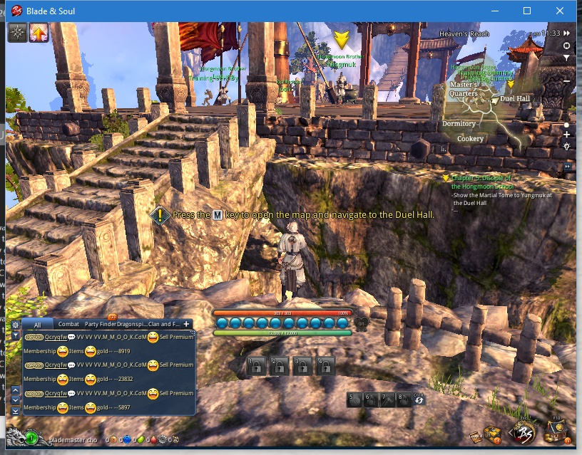

# Sensei-Notes

## Missing functionality for Quests:
(requires some work by the sensi master)
 -  [ ] Teleport - Story Quest Required -- can currently be done via UI manipulation. Not sure how accurately this can be done.
 
 -  [x] Fuse Items - Story Quest Required -- Currently can be done via UI manipulation. 
   -  [ ] Would be nice to be able to get information about the Item Selection Windows to have better control over whats going to be used

 -  [ ] Cutscene Skipping
   -  [ ] Cutscenes currently break tags. (have to stop and start the bot to get it moving again) 
 
## Profile & Tag Issues:
 -  [ ] UseItem currently throws a NullReferenceException. See log: https://gist.github.com/zzi-zzi-zzi/2355ad04aa57acb2e6a9167a77843b12 
 -  [ ] If an exception is thrown by a profile tag during execution the bot continues to execute that tag. continuing to throw exceptions until it crashes. 
 -  [ ] MoveTo doesn't work all the time? (could be related to the navigation issues)
   ```
   Moving to X:-8468 Y:44228 Z:2232 within 3 units.
   Done!
   
   Player Position:  X:-9067.64 Y:42410.5 Z:2232.26
   ```

## Bot Issues:

 -  [ ] Bot has started forgetting the selected routine and enabled plugins

## Navigation issues:

 -  [ ] Bot has problems with doors (cuts short)
 -  [ ] Bot has problems with some objects on the ground (cuts too close)
 -  [ ] Bot has navigation problems in stargin zone: (doesn't take the stairs) 
     
